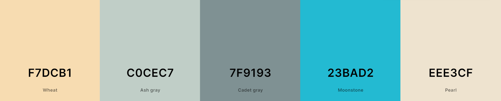
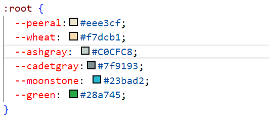
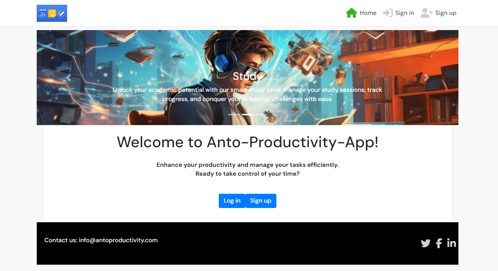
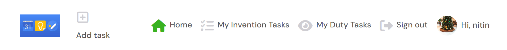
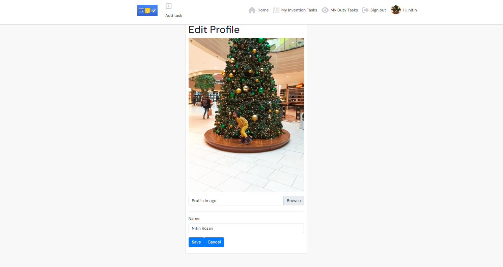

# Anto-Productivity-App
Developer: Anthony Raj 

[View live website]()

## Table of Contents
  1. [About](#about)
  2. [Project Goals](#project-goals)
  3. [User Experience](#user-experience)
      1. [Target Audience](#target-audience)
      2. [User Requirements and Expectations](#user-requirements-and-expectations)
      3. [User Stories](#user-stories)
      4. [Site Owner Stories](#site-owner-stories)
  4. [Technical Design](#technical-design)
      1. [Agile Design](#agile-design)
      2. [CRUD Functionality](#crud-functionality)
      3. [Colours](#colours)
      4. [Fonts](#fonts)
      5. [Wireframes](#wireframes)
  5. [Technologies Used](#technologies-used)
      1. [Coding Languages](#coding-languages)
      2. [Frameworks and Tools](#frameworks-and-tools)
      3. [Libraries](#libraries)
  6. [Front-End](#front-end)
      1. [React](#react)
  7. [Back-End API](#back-end-api)
      1. [Django REST Framework](#django-rest-framework)
  8. [Features](#features)
  9. [Future features / improvements](#future-features--improvements)
  10. [Validation](#validation)
      1. [HTML](#html-validation)
      2. [CSS](#css-validation)
      3. [ESLint JavaScript JSX Validation](#eslint-javascript-jsx-validation)
      4. [Chrome Dev Tools Lighthouse](#chrome-dev-tools-lighthouse-validation)
      5. [WAVE Validation](#wave-validation)
  11. [Testing](#testing)
      1. [Device Testing](#device-testing)
      2. [Browser Compatibility](#browser-compatibility)
      3. [Manual Testing](#manual-testing)
  12. [Bugs](#bugs)
  13. [Deployment](#deployment)
      1. [Heroku](#heroku)
      2. [Forking GitHub Repo](#forking-the-github-repository)
      3. [Clone a GitHub Repo](#clone-a-github-repository)
  14. [Credits](#credits)
      1. [Tutorial](#tutorials)
      2. [Code](#code)
      3. [Literature](#literature)
      4. [Misc](#misc)
  15. [Acknowledgements](#acknowledgements)

  ## About

The Anto-Productivity-App It web app has been developed to provide user's the chance to create, Edit, Delete, Assign to others and carry out tasks online.

## Project Goals

The goal for this project was to build a productivity platform in which users can create tasks where other users who feel they can help, can carry out the work as described in the task detail. Tasks can be assigned to members and packs can also be created to group tasks together.

The key functionality aspects:

- The site to be simple and use intuitive navigation across all pages
- User authentication
- User interaction via Tasks, My Invention Task and My Duty Task
- User's to have their own profiles with brief description, profile image and tab group consisting of their owned tasks, packs and other users tasks which they have been assigned
- CRUD functionality for task, My Invention Task, My Duty Task and their Profile
- Tasks filtering by keyword search, new tasks and high priority tasks
- Responsiveness to allow pleasant usage of the app across a range of devices with varying display sizes

## User Experience

### Target Audience

- People who would like help with completing a task
- Duty task people can update the status. The state should be open,in progress and completed 
- People who would like to keep track of outstanding tasks they may have
- People who are looking for some tasks to help others with

### User Requirements and Expectations

- A site which provides a high level of interactiveness between users
- Links and functions to act as expected
- Notification to provide feedback on expected function outcomes
- Simple "to the point" content that a user can easily digest
- Accessibility for impaired users
- Responsiveness to allow pleasant use across devices of different screen sizes 

### User Stories

1. As a new user, I can register an account with Anto-Productivity-App It so that I can become a member and use the app as intended.
2. As a user, I can use the navigation bar so that I can seamlessly navigate around the app.
3. As a user, I can see visual indicators for example of having my invention task in that i can choose work, study and fitness / If i wish to assign to other user 
4. As a user, I can watch and unwatch tasks so that I can keep up to date with that particular task via a filtered list.
5. As a user, I can view a list of my watched tasks so that I can focus on content I wish to view.
6. As a user, I can use the search bar on the Task list section so that I can find particular tasks easier.
7. As a user, I can delete my tasks so that I can permanently remove tasks I do not wish to keep.
8. As a user, I can edit my tasks so that I can correct spelling mistakes I may have entered into the task information fields.
9. As a user, I can view task comments so that I can obtain more information on the task in question.
10. As a user, I can comment on other tasks so that I can interact with other users.
11. As a user, I can edit or delete my comment on a task incase of input error.
12. As a user, I can manage my tasks so that I can add, edit or delete tasks as needed.
13. As a user, I can request a password so that I can log back into my account if I have forgotten my password.
14. As a user, I can log in so that I can access my account, view my profile, tasks and other user's tasks.
15. As a user, I can log out so that other users using the same device cannot access my account.
16. As a user, I can have a profile page so that I and other users can view my list of tasks, packs and assigned tasks.
17. As a user, I can update my profile so that my profile can stay up to date with my latest information.
18. As a user, I can add a profile picture so that other members can easily recognize my tasks or comments.
19. As a user, I can view the Home Page so that I can understand what the website is about, create an account or log in.
20. As a user, I can display basic info on my profile page so that other members can learn more about me.
21. As a user, I can search for tasks via a task list or search bar so that I can find specific tasks.
22. As a user, I can fill in a contact form so that I can enquire about issues I may have regarding the app.
23. As a user, I can receive feedback so that I can confirm whether the contact form submission was successful or not.
24. As a user, I can scroll through the latest tasks on the app so that I can find new tasks to complete.
25. As a user, I can browse a list of user accounts so that I can view that particular account.
26. As a user, I can create tasks so that I can partake in the main purpose of the site.
27. As a user, I can create packs so that I can group tasks together.
28. As a user, I can delete my packs so that I can permanently remove packs I do not wish to keep.
29. As a user, I can edit my packs so that I can correct spelling mistakes or I may have entered into the pack information fields.

### Site Owner Stories

30. As the site owner, I would want to validate users' data entries on sign up so that users can create a log in which meets the requirements.
31. As the site owner, I would want to ensure only logged in users can post from their account and edit their profile so that data privacy is ensured.
32. As the site owner, I would want to have the ability to remove tasks and task comments so that I can keep the app clean and friendly.
33. As the site owner, I would want the site to be fully responsive so that users can use it across multiple devices and create a good user experience.
34. As the site owner, I would want to use the app search function so that I can search for particular tasks by their title.
35. As the site owner, I would want a 404 error page so that users do not have to use the back navigation button if an error occurs.
 

##### Back to [top](#Anto-Productivity-App)

## Technical Design

### Agile Design

An Agile approach to creating this app has been applied. GitHub's projects were used to track user stories and implement ideas based on their level of importance for allowing the use of the app with no loss of functionality or user experience. Three categories were created indicating their level of importance, those were:
- MUST HAVE
- SHOULD HAVE
- COULD HAVE

By using AGILE methodology in this project I was able to deliver a site that had all the required functionality and some more. Due to the time limit on this project, I was not able to incorporate all initially listed features, but this is where an AGILE approach is great for app design. The project displays this by having User stories in the Done section and the ones which were decided to be left for the future, put in the future implementations section of the readme.

The GitHub project can be found [here]()

### CRUD Functionality
Anto.Productivity-App handles data with full CRUD Functionality:
 
- Create -  Users can create, an account, profile, Addtasks, my invention tasks,my duty task
- Read - Users can view the addtasks, packs of other users and also the profiles of these users.
- Update - Users can update their profile eg. edit, Delete 
- Delete - Users can delete tasks

### Surface

#### Color Scheme
All the colors were selected using the hero image to generate color scheme using coolors (https://coolors.co/generate)

For consistency and convenience, I created css root variables that I used throughout the project.

#### Fonts
Google Fonts were implemented on the website. 'Dm Sans' with a back up of sans-serif was decided as the ideal font for the site.

### Wireframes

## Technologies Used

### Coding Languages

- HTML
- CSS
- Javascript
- React (18.2.0)

### Frameworks and Tools

- [Axios](https://axios-http.com/docs/intro) - Axios is a Promise API. Justification: I used axios to send API requests from the React project to the API and avoid any CORS errors when sending cookies.
- [JWT](https://jwt.io/) - Library to decode JSON Web token. Justification: I used JWT to securely transmit data and to have the ability to verify that the content has not been tampered with.
- [React 18](https://17.reactjs.org/) - JavaScript library for building user interfaces. Justification: To be able to showcase my newly learnt skills and for building interactive user interfaces quickly.
- [React-Bootstrap 1.6.3](https://react-bootstrap-v4.netlify.app/) - CSS framework. Justification: I used Bootstrap React library for UI components, styling and responsiveness.
- [React Infinite Scroll](https://www.npmjs.com/package/react-infinite-scroll-component) - React library. Justification: I used this component to load content (tasks/comments/users) automatically as the user scrolls towards the bottom of the page without having to jump to next/previous page.
- [React Router](https://v5.reactrouter.com/web/guides/quick-start) - Javascript framework for routing. Justification: I used this library to enable navigation between views of components and to have the ability to control what is presented to the user based on the URL they have accessed in the browser. 
- [React ChartJS2](https://react-chartjs-2.js.org/) - React Library. Justification: I used this component for producing the doughnut chart on the main page. 
- [React Multi Select Component](https://www.npmjs.com/package/react-multi-select-component) - React Library. Justification: I used this component to have the ability to select multiple tasks to assign to a pack.

- [Am I Responsive](http://ami.responsivedesign.is/) - Website responsive test site. Justification: I used this to create the multi-device mock-up at the top of this README.md file
- [Balsamiq](https://balsamiq.com/) - Mock up software. Justification: I used this to create the projects wireframes
- [Chrome dev tools](https://developers.google.com/web/tools/chrome-devtools/) - Developer tool. Justification: I used this for debugging of the code and checking site for responsiveness
- [Cloudinary](https://cloudinary.com/) - File storage. Justification: I used this to store static files
- [Font Awesome](https://fontawesome.com/) - Icon library. Justification: I used this to style the site with icons.
- [Google Fonts](https://fonts.google.com/) - Font library. Justification: I used this to import fonts
- [Git](https://git-scm.com/) - Version control system. Justification: I used this for version control and to push the code to GitHub
- [GitHub](https://github.com/) - Cloud based hosting service. Justification: I used this as a remote repository to store project code
- [Gitpod](https://gitpod.io) - Cloud development environment. Justification: I used this to host a virtual workspace
- [Microsoft Paint] (https://apps.microsoft.com/store/detail/paint/9PCFS5B6T72H) - Graphics editor. Justification: I used this to edit the images for testing user stories.
- [Affinity Designer] (https://affinity.serif.com/en-gb/designer/) - Graphics editor. Justification: I used this to create the 404 and no search results images.
- Validation:
  - [WC3 Validator](https://validator.w3.org/) - HTML Validator. Justification: I used this to validate the applications HTML code
  - [Jigsaw W3 Validator](https://jigsaw.w3.org/css-validator/) - CSS Validator. Justification: I used this to validate the applications CSS code
  - [ESLint](https://eslint.org/) - JavaScript Validator. Justification: I used this to validate applications JSX code
  - [Lighthouse](https://developers.google.com/web/tools/lighthouse/) Site auditing tool. Justification: I used this to validate performance, accessibility, best practice and SEO of the application
  - [Wave](https://wave.webaim.org/) - Site accesibility auditor. Justification: I used this to evaluate the applications accessibility

### Libraries

#### Installed Libraries

| Package       | Version        |
| ------------- | ------------- |
| axios |1.6.2 |
| bootstrap | 4.6.0 |
| jwt-decode | 3.1.2 |
| react-bootstrap | 1.6.3 |
| react-chartjs-2 | 3.0.4 |
| react-dom | 18.2.0 |
| react-infinite-scroll-component |6.1.0 |
| react-multi-select-component | 4.3.4 |
| react-router-dom | 5.3.0 |
| react-scripts | 5.0.1 |
| react-scroll | 1.8.9 |
| mui/material | 5.14.20|
| web-vitals | 2.1.4 |

##### Back to [top](#Anto-Productivity-App)

## Front-End

### React

The React.js framework is an open-source JavaScript framework and library developed by Jordan Walke, a software engineer at Meta. It's used for building interactive user interfaces and web applications quickly and efficiently with significantly less code than you would with vanilla JavaScript.  

I used React for this application for several reasons:

 - Flexibility – Due to having a modular structure React code is easier to maintain compared to other front-end frameworks.

 - Speed – Creating sites/apps with React significantly increases the page loading speed as the entire page does not require to refresh and reload all components. Components are updated dynamically thus reducing the wait and load times, which affects user experience.

 - React Bootstrap - When used for styling and responsiveness React Bootstrap is a great choice as it comes with ready-to-use React-built components thus taking away a lot of the need to create commonly used code from scratch.

- It is the most widely used library for developing social networking and media content applications - Sites such as Meta (formerly Facebook), Instagram, Netflix, and Airbnb are all made with React.

- Reusability of components – Components can be created and re-used throughout the app with no need to rewrite code for the same features.

There were various components created and reused across this application.

### Home page

The home page of the productivity app features a visually engaging carousel highlighting key app functionalities related to work, study, and fitness. Below the carousel, a welcoming card introduces users to the "Anto-Productivity-App," emphasizing productivity enhancement and efficient task management. For users not logged in, prominent login and signup buttons are provided. The page concludes with a responsive footer displaying contact information and social media links. Implemented using React, the page maintains a cohesive design through React Bootstrap and custom CSS modules. Overall, the home page effectively communicates the app's purpose and encourages user interaction.

Home page image

### Nav Bar

The navigation bar of the Anto-Productivity-App is designed for user-friendly navigation and quick access to key features. It typically includes links to various sections of the app, such as Home, my duty tasks, my invention tasks , profile. Additionally, there are options for users to log in or sign up, enhancing the user experience by providing easy access to account management. The design is clean and intuitive, ensuring users can effortlessly navigate through the app.

Nav Bar image

### Profile Section

Profile Section is a feature of the Anto-Productivity-App giving users some personality on the platform and also user can edit/save profile image and name 

Profile Section image

## Code Validation

### HTML

The html code of the website was validated using [W3 Markup Validator](https://validator.w3.org/). 
For pages that require authentication I used "validate by direct input" method with source code. 
At the time of deployment the validation have the following outcome:  

The following pages have been tested by direct input:
* Home
* Menu
* Make a booking
* Where to find us
* Reviews
* Profile
* Manage bookings
* Login/Register/Logout
* 403/404/500 custom pages

| Template | Validation Result |  Final validation
|--------|-----------|---------|
| index.html | no errors | pass|
| menu.html | no errors | pass |
| reviews.html | no errors | pass |
| contact.html | no errors | pass
| booking.html | no errors | pass
| managebookings.html | no errors | pass ||
| profile.html | no errors| pass
| 404.html | no errors | pass |
| 500.html | no errors | pass |
| 403.html | no errors | pass |
| signup.html | no errors | pass |
| logout.html | no errors | pass |
| login.html | no errors | pass |

### CSS

The CSS code was validated using [W3 Jigsaw Validator](https://jigsaw.w3.org/css-validator/) 
At the time of deployment the validation for *style.css* has the following outcome:  

